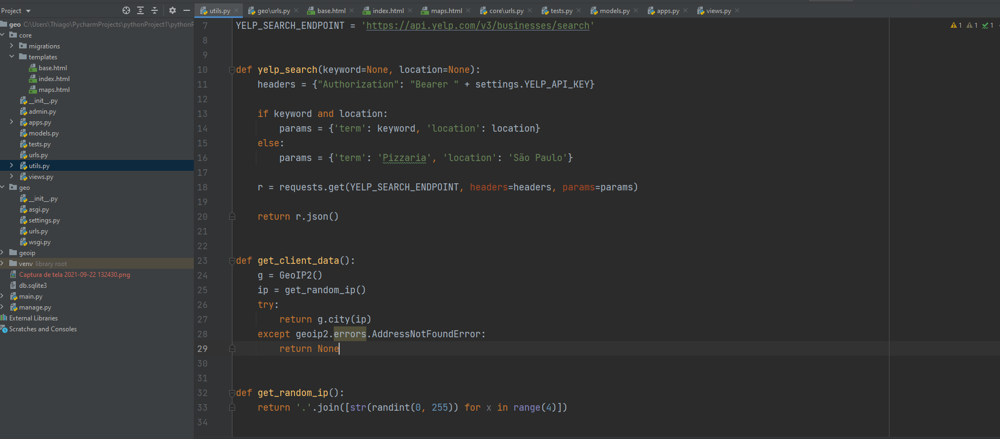
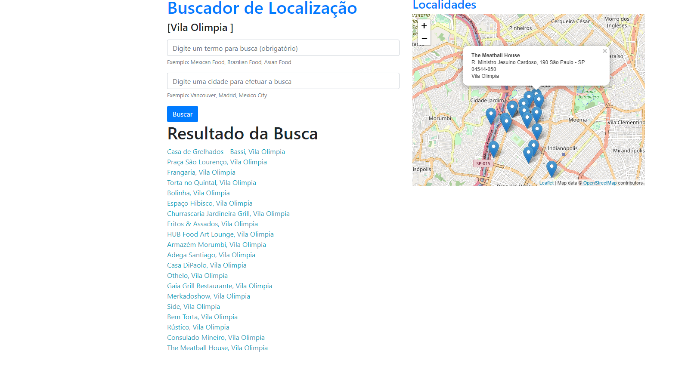

## Trabalhando com Geolocalização
> Consumindo uma API de Geolocalização.

### Exemplo de uso

Criei um aplicação que permite fazer uma localização geográfica de produtos.

A idéia é poder ofertar um produto para um determinado local que se encontra.

#### Ambiente de Desenvolvimento

Projeto feito com Python, Django, HTML e bootstrap.

